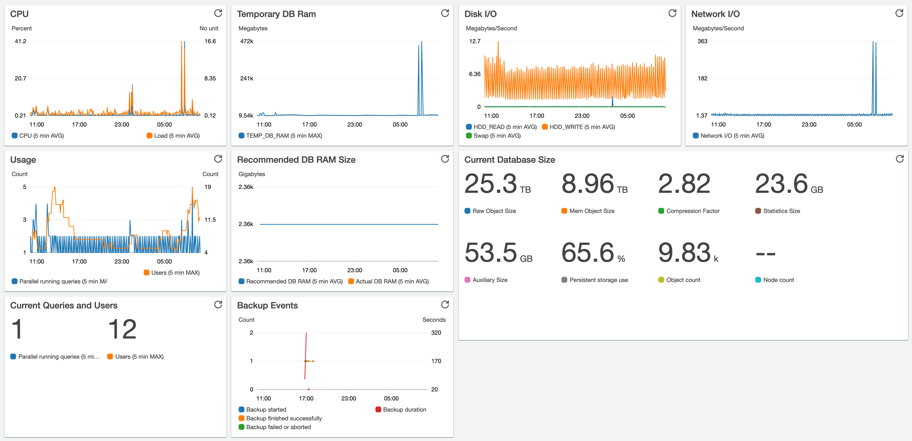

# Exasol CloudWatch Example Dashboard

[](https://github.com/exasol/cloudwatch-dashboard-examples/actions/workflows/ci-build.yml)

[](https://sonarcloud.io/dashboard?id=com.exasol%3Acloudwatch-dashboard-examples)

[](https://sonarcloud.io/dashboard?id=com.exasol%3Acloudwatch-dashboard-examples)
[](https://sonarcloud.io/dashboard?id=com.exasol%3Acloudwatch-dashboard-examples)
[](https://sonarcloud.io/dashboard?id=com.exasol%3Acloudwatch-dashboard-examples)
[](https://sonarcloud.io/dashboard?id=com.exasol%3Acloudwatch-dashboard-examples)

[](https://sonarcloud.io/dashboard?id=com.exasol%3Acloudwatch-dashboard-examples)
[](https://sonarcloud.io/dashboard?id=com.exasol%3Acloudwatch-dashboard-examples)
[](https://sonarcloud.io/dashboard?id=com.exasol%3Acloudwatch-dashboard-examples)
[](https://sonarcloud.io/dashboard?id=com.exasol%3Acloudwatch-dashboard-examples)

This project contains an [AWS CDK](https://aws.amazon.com/cdk/) template for an example CouldWatch dashboard that visualizes the metrics reported by the [Exasol – Cloud Watch adapter](https://github.com/exasol/cloudwatch-adapter).

This dashboard should get you started with Exasol and CloudWatch integration.



## Quick Usage

If you just want to use the example dashboard, you can simply download the latest AWS CloudFormation template in the [releases section](https://github.com/exasol/cloudwatch-dashboard-examples/releases/) and run it in cloudformation.

There you will have to set a Deployment Name. This is the name of your exasol installation you entered during the setup of the cloudwatch-adapter.

Now you can view and edit your cloudwatch dashboard in the AWS Console. You can also deploy this template multiple times and build different dashboards for different use cases.

## Advanced Usage

In this repository we define the dashboard by code using [AWS CDK](https://aws.amazon.com/cdk/). That allows us to define the dashboard in a very readable way.

You can use this as a starting point for your own dashboards. In contrast to changing the dashboard using the AWS Console that allows you for example to version your dashboards in Git, add a review process or simply copy the same dashboard for multiple Exasol deployments. For that you need to go through the following steps:

* Checkout (or fork) this repository
* Adapt the dashboard to your needs (modify [`src/main/java/com/exasol/cloudwatchexampledashboard/CloudwatchDashboardExamplesStack.java`](src/main/java/com/exasol/cloudwatchexampledashboard/CloudwatchDashboardExamplesStack.java))
* [Install the AWS CDK](https://docs.aws.amazon.com/cdk/latest/guide/getting_started.html#getting_started_install)
* Deploy your dashboard using
    ```shell
     cdk deploy --parameters deploymentName=<YOUR DEPLOYMENT NAME> --parameters clusterName=MAIN
    ```
  (Don't forget to replace `<YOUR DEPLOYMENT NAME>` with the value you configured during the CloudWatch-adapter setup)

## Injecting Metrics Values for Testing

To test your dashboard and alarms you can manually inject metrics values by executing commands like these:

```sh
aws cloudwatch put-metric-data --namespace "Exasol" --dimensions "Cluster Name=MAIN,Deployment=<YOUR DEPLOYMENT NAME>" --unit Seconds --value 30 --metric-name "BACKUP_DURATION"
aws cloudwatch put-metric-data --namespace "Exasol" --dimensions "Cluster Name=MAIN,Deployment=<YOUR DEPLOYMENT NAME>" --unit Count --value 1 --metric-name "EVENT_BACKUP_START"
aws cloudwatch put-metric-data --namespace "Exasol" --dimensions "Cluster Name=MAIN,Deployment=<YOUR DEPLOYMENT NAME>" --unit Count --value 1 --metric-name "EVENT_BACKUP_END"
aws cloudwatch put-metric-data --namespace "Exasol" --dimensions "Cluster Name=MAIN,Deployment=<YOUR DEPLOYMENT NAME>" --unit Count --value 1 --metric-name "EVENT_BACKUP_ABORTED"
```

## Additional Information

* [Changelog](doc/changes/changelog.md)
* [Dependencies](dependencies.md)
